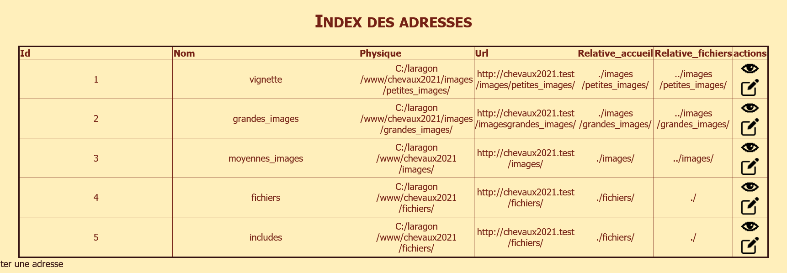

<h1>Imageur, mon premier projet Symfony</h1>

A l'origine, une interface de gestion d'images pour mon site Web, <a href="http://chrizedday.free.fr">les chevaux de Christine</a>. Imageur enregistre les images dans une base de données avec leur nom, leur usage (image isolée ou incluse dans un carrousel), leur texte alternatif et leur légende. Les images isolées sont de taille fixe, les images de carrousel sont un binôme grande image + vignette 150 x 100 pixels. les vignettes portent le même nom de fichier que la grande image correspondante et sont enregistrées dans images/petites_images, les grandes dans images/grandes_images et les images isolées à la racine d'images. Les vignettes peuvent être téléchargées à la création ou par modification ultérieure.

les carrousels de mon site Web sont gérés par une fonction javascript qui lors d'un clic sur une vignette déclenche le carrousel à partir de l'image cliquée (pour l'instant le carrousel inclut toutes les images de la page sauf les isolées). Les "alt" concernent les vignettes et les images isolées et la légende (figcaption) les grandes images du carrousel.

<a href="main.js">Code javascript des carrousels </a>

Une fois le carrousel renseigné en base de données, on peut le générer automatiquement en PHP pour n'avoir plus qu'à l'envoyer sur le site et l'inclure dans la bonne page au bon endroit.

Mais finalement, tant qu'à générer les carrousels, pourquoi ne pas générer directement les sections, puis les articles, ainsi que les menus correspondants?
 Du coup, mon projet est sur le point de se transformer en mini CMS qui fonctionne en local pour gérer un site distant statique!

 
 
Imageur est configuré pour un site qui a l'architecture suivante, et qui se trouve dans un dossier ectérieur à Imageur:

 <h1>Index of /chevaux2021</h1>
<ul><li><a href="/"> Parent Directory</a></li>
<li><a href="fichiers/"> fichiers/</a></li>
<li><a href="images/"> images/</a></li>
<li><a href="ressources/"> ressources/</a></li>
</ul>

Tous les fichiers PHP se trouvent à la racine de fichiers

<h1>Index of /chevaux2021/images</h1>
<ul><li><a href="/chevaux2021/"> Parent Directory</a></li>
<li><a href="grandes_images/"> grandes_images/</a></li>
<li><a href="petites_images/"> petites_images/</a></li>
</ul>

<h1>Index of /chevaux2021/ressources</h1>
<ul><li><a href="/chevaux2021/"> Parent Directory</a></li>
<li><a href="css/"> css/</a></li>
<li><a href="js/"> js/</a></li>
</ul>

Les fichiers de configuration (nom du site, URLs, auteur, etc...) sont dans le dossier config, services.yaml et twig.yaml dans le sous-dossier packages (j'ai fini par le trouver, il va m'être bien utile!) 
Je travaille actuellement à mettre toute l'architecture du site généré dans les fichiers de config afin que ce soit plus facile à adapter à n'importe quel site.
 

 
Pour le javascript de la vue twig des carrousels (main.js qui est dans le dossier public/js), il faut mettre la valeur {{ grandes_images }} dans un input hidden pour la récupérer (ça ne concerne pas le site généré, pour lequel il faut l'url du dossier grandes_images du site en dur, évidemment).

 
Pour accéder aux adresses hors des contrôleurs ou des vues, notamment dans mon tout nouveau service Generator, j'ai créé une entité adress avec sa table:

